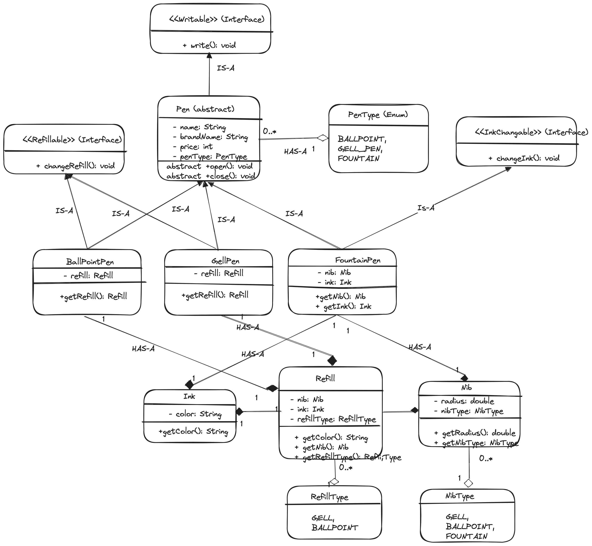

# Overview

Pen is something which is used to write

# Questions

1.  For Pen I can think of name, brandName and price as attributes. Doyou want any other attributes which I should consider?

2.  There are many types of Pens but I'm considering only BallPoint Pen, Gell Pen and Fountain Pen. Do I need to consider any more types?

3.  These are the core requirements of Pen class I can think of. Do you want any other requirement which I need to consider in this current scope?

# Requirements

1.  Pen is something that can be used to write

2.  Each Pen has a name, brand name and price

3.  There are many pen types, some of them are BallPoint Pen, Gell Pen and FountainPen

4.  BallPoint Pen and Gell Pen has refill

5.  BallPoint Pen and Gell Pen can change refill

6.  Refill has ink and the nib

7.  Nib has radius

8.  Ink can be of different color

9.  Fountain Pen has no refill it directly contains ink and the nib

10. Apart from the write behaviour, Pen also has open and close behaviours i.e you can open and close via cap or by clicking or by rotating

## Entities And Attributes

1.  Pen

    a.  Name

    b.  Brand name

    c.  Price

    d.  Type (BallPoint, Gell, Fountain)

2.  Refill

    a.  Ink

    b.  Nib

    c.  Type (BallPoint, Gell, Fountain)

3.  Ink

    a.  color

4.  Nib

    a.  Radius

    b.  Type (BallPoint, Gell, Fountain)

5.  BallPointPen

6.  GellPen

7.  FountainPen

# Class Diagram

